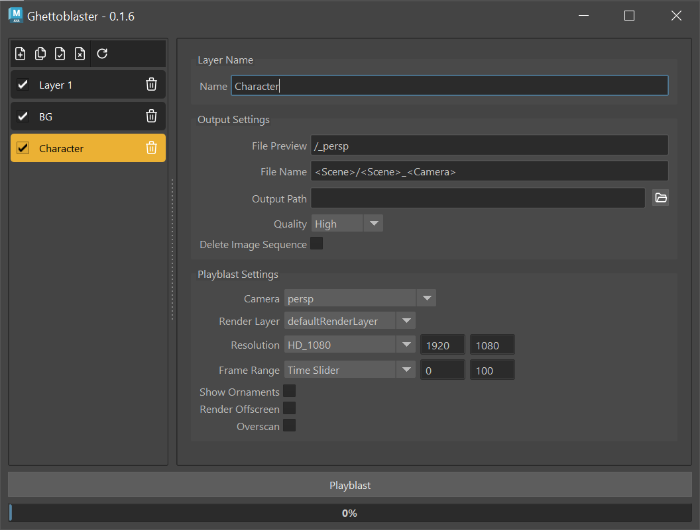

# Ghettoblaster

## A Maya Multilayer Playblasting Tool



### Description

Ghettoblaster is a Multilayer Playblasting Tool for Maya written in Python using PySide2.

- Support for Render Layers
- Create Multiple Playblast Layers and Settings and batch render them all at once!
- Automatically Convert the Playblast to a MP4 Video
- Control Playblast Settings
- Dynamic Naming Controls

### Requirements

- Ghettoblaster currently only supports Maya 2023 and 2024 on Windows and MacOS. Other Maya Versions and Operating Systems may work but are not tested.

### Installation

1. Clone the Ghettoblaster repository or download the zip and extract it in your ../documents/maya/scripts directory

2. Open the install.bat file in a Text Editor and change the mayapy_path to the mayapy.exe of your Maya installation

```shell
set mayapy_path="C:\Program Files\Autodesk\Maya2024\bin\mayapy.exe"
```

4. Run the install.bat file

5. Open Maya and run following Python snippet in the Maya Script Editor

```shell
import ghettoblaster
ghettoblaster.main()
```

### Documentation
